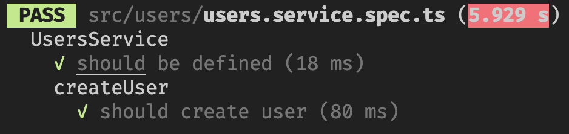
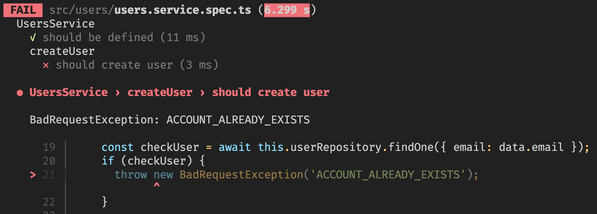

## Nest.js에서의 unit-test

Nest.js는 기본 테스트 라이브러리로 jest를 지원하고 있다. CLI로 서비스나 컨트롤러를 생성할 때 파일명 뒤에 `spec.ts`가 붙은 파일이 테스트를 위해 자동으로 생성된다.

```js
import { Test, TestingModule } from '@nestjs/testing';
import { UsersService } from './users.service';

describe('UsersService', () => {
  let service: UsersService;

  beforeEach(async () => {
    const module: TestingModule = await Test.createTestingModule({
      providers: [UsersService],
    }).compile();

    service = module.get < UsersService > UsersService;
  });

  it('should be defined', () => {
    expect(service).toBeDefined();
  });
});
```

> spec.ts가 생성되었을 때 기본 코드

---

## Jest란?

일단 Nest.js의 unit-test를 작성하기 전에 Jest에 대해서 알아볼 필요가 있다고 생각한다.

Jest는 Facebook에서 만든 테스트 라이브러리이고 Jest가 나오기 이전에 javascript 코드를 테스트하기 위해서는 여러 가지 테스트 라이브러리들을 설치해서 서로 조합해서 사용해야 했는데 Jest를 사용할 경우에는 많은 기능을 한 번에 지원하기 때문에 효과적인 테스트 라이브러리라고 할 수 있다.

테스트 코드가 직관적이기도 하고 문서화도 잘 되어있어 생산성, 가독성 면에서도 효과적이다!

---

## Nest.js에서의 Jest를 활용한 Mocking

이제 Nest.js에서의 Jest를 활용한 Mocking을 진행해 볼 텐데 그 전에 일단 Mocking이 뭔지 간단하게 정리해보겠다.

### Mocking?

Mocking은 단위 test를 작성할 때 해당 코드가 의존하고 있는 부분을 가짜로 대체하는 기법을 말한다. 일반적으로 테스트할 코드가 의존하는 부분을 직접 생성하기 어려운 경우 mocking이 많이 활용된다!

Mocking을 하지 않고 실제 환경과 같이 테스트 환경을 설정하게 됐을 때 실제 db를 사용한다면 여러 문제점이 발생될 수 있는데

- db 접속과 같이 network이나 I/O 작업이 포함된 테스트는 실행 속도가 느려짐
- CI/CD의 일부에 테스트가 자동화되어 있다면 속도가 느려서 문제가 생길 수 있음
- 테스트 자체를 위한 코드보다 db와 연결하고 트랜잭션 생성, 쿼리 전송하는 코드가 더 길어질 수 있음
- 테스트 실행 순간 db가 오프라인 된다면 테스트는 실패하고 테스트 자체가 인프라 환경에 영향을 받음

위와 같은 문제 말고도 여러 가지 크고 작은 문제들이 발생할 수 있고, 특정 기능만 분리해서 테스트하겠다는 **unit test의 목적에 부합하지 않게**된다.

Mocking은 이런 상황에서 실제 객체처럼 사용 가능한 가짜 객체를 생성하는 메커니즘 제공 및 테스트 실행 중 가짜 객체에 어떤 일들이 발생했는지 기억하고 있기 때문에 내부적으로 이 객체가 어떻게 사용되는지 검증이 가능하다.

---

### Mocking으로 테스트 환경 준비

Mocking이 어떤 건지 간단하게 알아봤으니 실제 jest에서 어떻게 mocking으로 unit-test 환경을 준비할지 코드로 확인해 보자!

```ts
const mockUserRepository = {
  save: jest.fn(),
  findOne: jest.fn(),
};

/* 
MockRepository를 type alias로 정의하고 Partial, Record등의 유틸리티 클래스를 사용하여 repository를 mocking할 준비를 한다.
Record를 사용하여 Repository<T>의 메서드를 추출한 값을 key값 타입으로, jest.Mock을 value값으로 갖는 타입을 리턴한다.
그리고 Repository의 메서드를 전부 사용할 것이 아니기 때문에 Partial을 사용해서 메서드를 optional하게 가져왔다.
*/
type MockRepository<T = any> = Partial<Record<keyof Repository<T>, jest.Mock>>;

describe('UsersService', () => {
  let service: UsersService;
  let userRepository: MockRepository<User>;

  beforeEach(async () => {
    const module: TestingModule = await Test.createTestingModule({
      providers: [
        UsersService,
        { provide: getRepositoryToken(User), useValue: mockUserRepository }, //custom provider
      ],
    }).compile();

    service = module.get<UsersService>(UsersService);
    userRepository = module.get<MockRepository<User>>(getRepositoryToken(User));
  });

  it('should be defined', () => {
    expect(service).toBeDefined();
  });
});
```

- `MockRepository`를 활용하여 `Repository`를 Mocking
- 여기서 mocking할 Repository는 하나이기 때문에 `mockUserRepository`를 object 형태로 작성해뒀지만 여러 repository를 mocking하는 경우에는 함수로 작성해 주는 게 좋다.
- `mockUserRepository`에서 현재 사용할 메서드는 `save`와 `findOne`이기 때문에 두 메서드를 `jest.fn`을 사용해서 메서드를 mocking해줬다.
- `getRepositoryToken`을 custom provider로 사용했는데 `@InjectRepository()`를 사용하여 `UsersRepository`를 요청할 때마다 `useValue`로 등록된 `mockUserRepository`객체를 사용하게 된다.

위처럼 설정해두면 mocking은 완료됐고 테스트 코드를 작성할 때 db에 직접 접속하게 되는 것이 아니라 mocking한 repository를 호출하게 된다.

---

### unit-test 작성해보기

그럼 유저를 생성하는 함수를 테스트하는 코드를 작성해보자!

```ts
describe('createUser', () => {
  const createUserArguments = {
    email: 'test@test.co.kr',
    password: 'rhrlrkr1234',
    name: 'tester',
    phoneNumber: '010-1234-1234',
  };

  it('should create user', async () => {
    userRepository.findOne.mockResolvedValue(undefined);
    userRepository.save.mockResolvedValue(createUserArguments);

    const result = await service.createUser(createUserArguments);

    expect(userRepository.save).toHaveBeenCalledTimes(1);
    expect(userRepository.save).toHaveBeenCalledWith(createUserArguments);

    expect(result).toEqual({ success: true });
  });
});
```

- `createUserArguments`부분은 유저 생성을 위해서 미리 작성해둔 arguments이고 아래에서 mocking한 함수를 사용할 때 이 값을 넣어서 호출하면 된다.
- `mockResolvedValue`는 promise를 반환할 때 사용하는데 `save`는 `promise<User>`를 반환하기 때문에 인자로 `createUserArguments`를 설정해 줬다.
- `toHaveBeenCalledTimes`를 사용하게 된다면 해당 method가 몇 번 호출되었는지 체크할 수 있다.
- `toHaveBeenCalledWith`은 위와 비슷하게 어떤 인자를 받았는지 체크할 수 있다.
- 마지막으로 createUser의 return값이 정상적으로 나오는지 체크한다.

---

### unit-test가 정상 작동하는지 확인하기

현재 내가 테스트할 부분은 user의 service내 로직을 테스트할 것이기 때문에 `npm run test user.service`명령어를 터미널에 실행하게 되면 `user.service`을 테스트할 수 있게 된다.

명령어를 실행하고 기다리게 되면!!!!



이렇게 정상적으로 테스트가 완료된 것을 볼 수 있다!

만약 테스트가 실패하게 되는 경우에는😿



이렇게 어느 테스트에서 실패했는지, 어떤 로직에서 다른지 등등 자세하게 표시해 줘서 어떤 것이 문제인지 빠르게 파악할 수 있다.

---

### 마치며

Jest를 사용하면 unit-test를 확실히 쉽게 할 수 있는 장점이 있다. 현재 예전에 진행했던 프로젝트를 django에서 nest.js로 마이그레이션 하고 있는데 unit-test를 확실하게 작성하며 진행하려고 하다 보니 인턴십을 진행할 때는 보지 못했던 디테일한 함수의 사용법 등을 다시 확인하게 되었다. 아직 이번 글에서 소개하지 못한 jest의 여러 기능들이 존재하는데 그런 부분들은 앞으로 코드 작성을 하면서 블로그에 다른 글로 정리해 볼 것이다!

정보에 잘못된 부분이 있다면 댓글로 피드백 주시면 확인 후 수정하도록 하겠습니다!😃

<br>
<br>
<br>
<br>
<br>

---

**ref.**

[출처 1](https://www.daleseo.com/jest-fn-spy-on/)
[출처 2](https://darrengwon.tistory.com/1004?category=915252)

```toc

```
