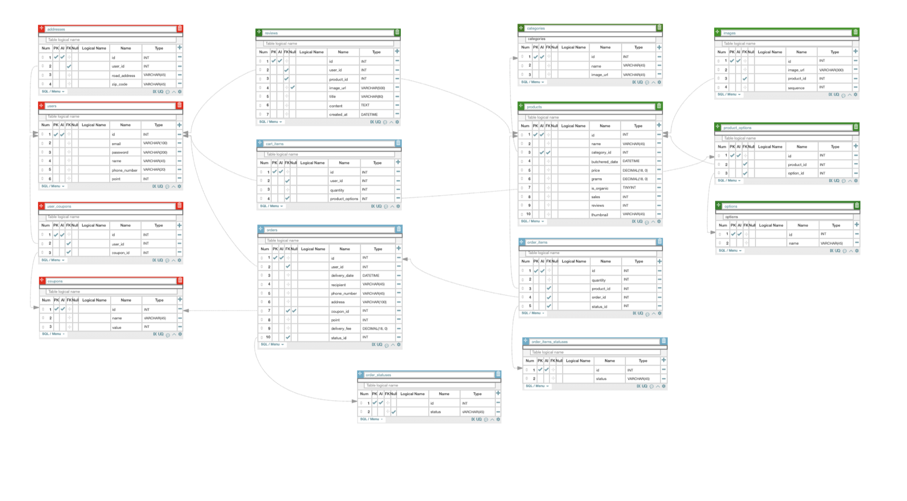
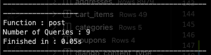

# [Project] 고기각 리뷰

# 프로젝트 고기각🍖

- 정육각 사이트를 모티브로 한 팀 프로젝트

## 개발 기간 및 인원

- **개발 기간**
  2021년 7월 5일 - 2021년 7월 16일 (2주)
- **개발 인원**
  - FE : 박관용, 이재현, 장운서
  - BE : **이준영**, 서정민, 최현정

## 모델링



## 사용한 기술 & 툴

- Python
- Django
- MySQL
- pyJWT
- Bcrypt
- AWS (EC2, RDS)
- Git, Github
- Trello
- Slack
- Notion

## API Document

[고기각 Back End API](https://www.notion.so/Back-End-API-ce0860b3e0f345f8a02384b0e91248f3)

## Github Repository

[GitHub - Pratiable/Project_gogigak](https://github.com/Pratiable/Project_gogigak)

## 구현했던 기능

(본인이 구현한 기능은 ✅로 표현하였습니다)

- 제품 리스트 필터링 기능 (카테고리 별, 판매순/리뷰순/가격순)
- 제품에 대한 리뷰 작성/읽기/삭제 기능
- 2개의 로그인 decorator를 이용한 비로그인/로그인 상태 별 리뷰 읽기 기능
- **장바구니의 제품 보기/추가/수량 변경/삭제 기능 및 재고, 판매량 관리**✅
- **장바구니에 있는 제품 구매 및 쿠폰 사용 기능**✅
- **구매 시 트랜잭션 구현**✅
- pyJWT와 Bcrypt를 사용한 정보 암호화 및 토큰 발급
- 유저 마이페이지 정보, 신선배송 가능 여부 확인 기능

## 고민을 많이 했던 부분들

장바구니를 처음 구현을 하려고 했을 때는 어떻게 구현해야 할 지 감이 오지 않았는데 천천히 생각 해보니 결국 장바구니도 C.R.U.D와 똑같다는 것을 알게 되어서 빠르게 구현까지 완료했다.

하지만 문제는 장바구니가 아닌 구매 로직에 있었다💦

내가 만든 코드는 결국 실행은 잘 되었지만 효율적이지 않은 코드 사용 및 수 많은 쿼리와 `N+1 Problem`을 가지고 있어서 전체적인 리팩토링이 필요했다.

구매를 진행 할 때 장바구니 테이블에 있던 row들을 구매내역으로 옮기는 로직이 필요했고 그것들의 생성 및 각 제품들의 재고 및 판매량 관리를 위해서 많은 db row들이 수정되어야 하는 상황이었다.
처음에는 단순하게 그냥 for loop을 사용하여 진행했었고 `atomic transaction`을 사용하긴 했었지만 중간에 `JsonResponse`로 return해야하는 부분이 있어서 문제가 있을때도 commit이 되어버렸기 때문에 method 전체를 `transaction`으로 연결하기 무리인 부분이 있었다.

```python
for cart_item in cart_items:
                if cart_item.quantity > cart_item.product_options.product.stock:
                    return JsonResponse({'message':f"{cart_item.name}_SOLD_OUT"}, status=400)
                
                total_quantity += cart_item.quantity
                total_price    += (cart_item.quantity * cart_item.product_options.product.price)
```

```python
for cart_item in cart_items:
                    cart_item.product_options.product.sales += cart_item.quantity
                    cart_item.product_options.product.stock -= cart_item.quantity
                    cart_item.product_options.product.save()
```

계속 고민중에 분명히 지금 save를 안해도 queryset을 전부 save해주는 method가 있지 않을까 생각하다가 `order_list`에 장바구니에서 받아온 item들로 row를 생성할 때 `bulk_create`를 사용해서 효과적으로 쿼리문을 줄이고 속도도 빨라지게 했던 기억이 있어서 update도 있지 않을까? 하고 찾아 본 결과 
`bulk_update` 라는 것이 존재하는걸 확인했다! (프로젝트 최종 발표 날 아침에.....🤣)

발표 전까지 수정을 해서 결국 아래 코드로 변경하게 되었다!

```python
product_updates   = []

    for cart_item in cart_items:
        if cart_item.quantity > cart_item.product_options.product.stock:
            return JsonResponse({'message':'SOLD_OUT','soldOutProduct':cart_item.product_options.product.name}, status=400)

        product_update = cart_item.product_options.product
        product_update.sales += cart_item.quantity
        product_update.stock -= cart_item.quantity
        product_updates.append(product_update)
 
        total_price += (cart_item.quantity * cart_item.product_options.product.price)

### 중간 생략 ###

    Product.objects.bulk_update(product_updates, fields=['stock'])
    Product.objects.bulk_update(product_updates, fields=['sales'])
```

위의 코드로 변경을 해서 `bulk_update`로 `JsonResponse`직전에 바뀐 field를 업데이트 하니 쿼리문도 그렇고 코드도 깔끔해지는 엄청난 효과가 있었다!

그리고 `select_related`를 사용하여 발생하는 쿼리를 줄여보려고 했으나 결국 최종 발표 전에는 수정하지 못하고 그 날 저녁에 위워크에 남아서 연구한 결과 문제되는 부분을 찾아서 수정까지 완료했다!

원래 처음에 만들었던 코드에서는 40개정도의 물품을 구매할 때 약 200개 이상의 쿼리문이 사용됐으나 프로젝트 발표가 끝난 저녁에는 10개 이하로 줄어드는 기적같은 모습을 확인할 수 있었다!!



이미 프로젝트가 끝났기 때문에 멘토님께 리뷰를 받을 순 없었지만 내 나름대로 정말 많이 고민하고 연구하며 이뤄낸 성과라고 생각하니 너무 뿌듯하고 첫 프로젝트에 얻어간게 너무 많다고 생각한다!

프로젝트를 진행하며 팀원들에게도 너무 감사했고 바로 시작 될 2차 프로젝트에서도 주니어 개발자로써 시작하게 될 나에게 기초를 단단히 다지며 동료들과 소통하고 같이 성장해 나가는 귀한 경험이 됐으면 좋겠다!

```toc
```